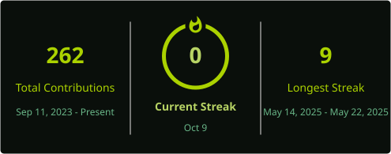

# ⚡About Me:
👨‍💻 Computer Science Student | Web Development   Hi, I'm Kunal Kharga, a Computer Science student and frontend developer. I am currently working with React and the MERN stack. I have experience with HTML, CSS, JavaScript, PHP, and MySQL.

## 🌐 Socials:
 

# 💻 Tech Stack:
       

# 📊 GitHub Stats:
 
 

